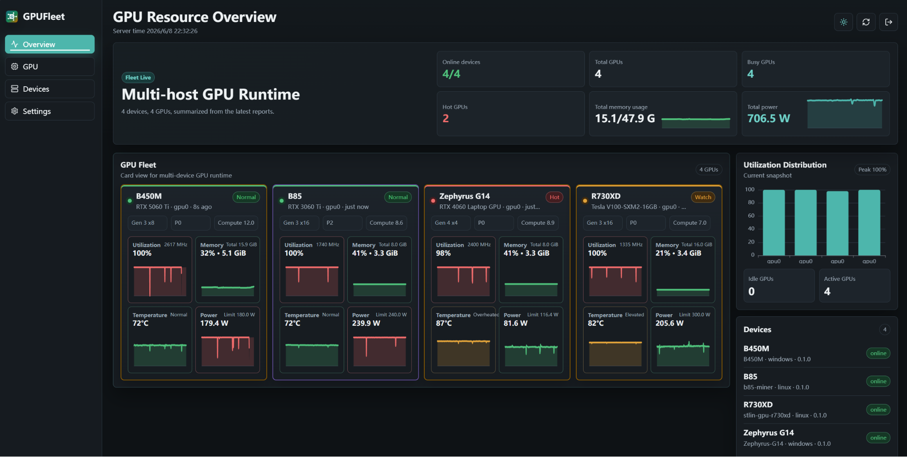
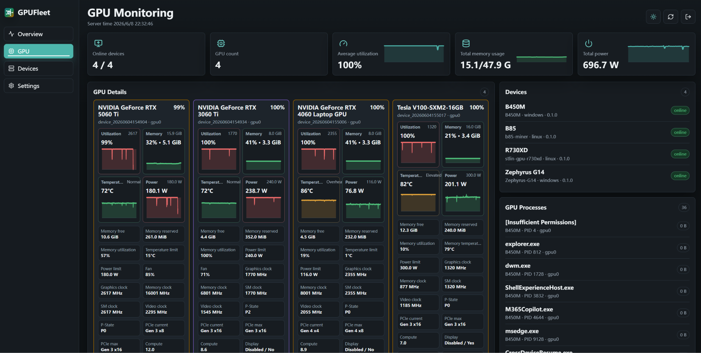
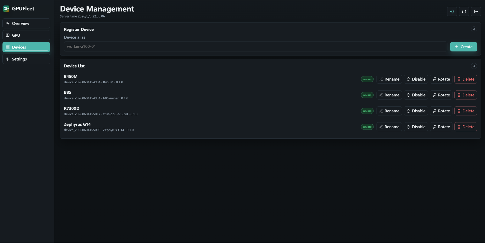
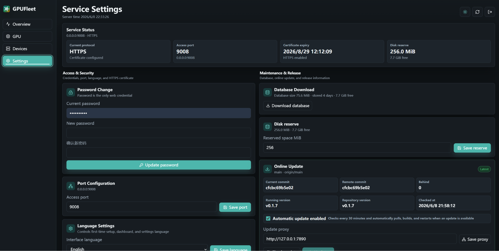

<h1>
  
  GPUFleet
</h1>

[](https://deepwiki.com/stlin256/GPU-Fleet/)
[](https://gpufleet-telemetry.stlin256.workers.dev/summary)

GPUFleet is an operations dashboard for NVIDIA GPU machines spread across different networks. It lets a public server collect read-only reports from Windows/Linux Agents, then shows which GPUs are online, how busy they are, how utilization, memory, temperature, and power changed over time, which devices went offline, and which processes are currently using GPU memory.

The product stays intentionally simple. The server handles login, device management, storage, statistics, diagnostics, backup, and online update. Each device runs a local Agent that only reads GPU state and actively reports to the server. The server never connects back to clients, sends commands, edits Agent configuration, kills processes, or changes GPU settings.

Chinese documentation: [README.md](README.md)

Installation guide: [docs/14-installation.md](docs/14-installation.md)

## What It Does

- Fleet overview: multi-host, multi-GPU cards with online state, utilization, memory, temperature, power, PCIe state, clock throttle reasons, and process summaries.
- History and statistics: per-GPU 2x2 trend charts for utilization, memory, temperature, and power; hover readings; 1H, 6H, 24H, 7D, and 30D statistics backed by rollup indexes.
- Energy view: derives 24H, 7D, and 30D kWh, cost estimates, thermal trends, per-GPU energy ranking, high-idle-power, throttle, and thermal diagnostics from existing read-only metrics. It does not issue power, fan, or clock controls.
- Device management: create devices, copy one-time secrets, rename, enable/disable, delete, and rotate secrets. These actions only change server-side records and never rewrite Agent configuration.
- Server operations: first-start language, password, port, and optional HTTPS setup; Settings controls for password, language, port, certificates, disk reserve, automatic update, and update proxy.
- Diagnostics and recovery: authenticated database download, read-only diagnostics package, Linux backup/restore scripts, automatic update source checks, remote build before fast-forward pull, binary replacement, and restart recovery.
- Guest access: optional `/guest` overview with sanitized device and GPU data. Guests cannot see processes, stats, real device IDs, hostnames, Agent metadata, driver versions, GPU UUIDs, VBIOS, or admin APIs.
- Lightweight deployment: the default stack is one Go server, one Go Agent, React static files, gzip JSONL metric segments, and JSON metadata. Prometheus, Grafana, and external databases are not required.
- Ecosystem signal: anonymous aggregate telemetry is enabled by default and only reports deployment version, server platform, active Agent count, and active GPU count for the README GPU badge. It never uploads hostnames, device IDs, GPU UUIDs, processes, usernames, secrets, or server URLs.

## Current Status

GPUFleet is currently at `1.0.11`. The core reporting path, dashboard, device management, guest access, long-range statistics, read-only energy and thermal visibility, online update, anonymous aggregate telemetry, diagnostics package, backup/restore scripts, and browser-level frontend smoke verification are implemented. VictoriaMetrics, SQLite, configurable alert rules, CSV export, and SSE live refresh remain planned enhancements.

## Product Screenshots









## First Startup

The first browser visit opens a setup flow:

1. Choose the interface language.
2. Set the web access password.
3. Set the next startup port.
4. Optionally upload an HTTPS certificate and private key.

Language changes apply immediately. Port and HTTPS certificate changes require restarting the current server process.

## Dashboard

The authenticated dashboard has Overview, GPU, Energy, Devices, and Settings views. Overview and GPU cards include compact sparklines and 24-hour expandable GPU charts. Energy shows current power, range energy, cost estimates, thermal trends, per-GPU energy ranking, high-idle-power, throttle, and thermal diagnostics. Settings includes service status, password, port, language, HTTPS certificates, energy display thresholds, database download, diagnostics package download, disk reserve, automatic/manual online update, manual service restart, guest access, setup wizard, repository attribution, release information, and the changelog dialog.

The guest dashboard at `/guest` is intentionally smaller: it shows a sanitized overview and GPU chart cards only. It hides GPU processes, 24-hour statistics, management controls, real device identifiers, host metadata, and internal GPU identifiers.

All confirmation, progress, guest records, changelog, update, restart, and fallback-dashboard dialogs use full-viewport blurred backdrops so they are not constrained by the current tab or panel layout.

## Run Server

```powershell
.\bin\gpufleet-server.exe `
  -addr 0.0.0.0:9008 `
  -data-dir data `
  -min-free-mb 800 `
  -retention-days 30 `
  -web-dir web/dist `
  -repo-dir .
```

## Register Agents

Create devices from the dashboard Devices page, copy each one-time secret, then run the Agent on the target machine:

```sh
./bin/gpufleet-agent \
  -server-url https://your-server:9008 \
  -device-id device_xxx \
  -secret replace-with-device-secret \
  -processes
```

On Windows, use the release package and install the Agent as a scheduled task from an elevated PowerShell window:

```powershell
.\scripts\install-agent-windows.ps1 `
  -ServerUrl "https://your-server:9008" `
  -DeviceId "device_xxx" `
  -Secret "replace-with-device-secret"
```

The installer validates the Agent version, runs a one-shot upload preflight by default, stores credentials in `C:\ProgramData\GPUFleet\agent.env` with restricted ACLs, and writes logs to `C:\ProgramData\GPUFleet\logs\agent.log`.

## Release Packages

Release artifacts are generated by `scripts/build-release.ps1` and the GitHub Release workflow. The default `full` matrix covers Windows, Linux, macOS, and FreeBSD across common Go-supported architectures, including Linux armv5/armv6/armv7 ARM variants. Windows/Linux are the primary supported Agent platforms for NVIDIA GPU collection; macOS/FreeBSD Agent packages are provided for completeness and diagnostics where `nvidia-smi` is available.

```text
gpufleet-server_<version>_windows_amd64.zip
gpufleet-agent_<version>_windows_amd64.zip
gpufleet-server_<version>_windows_arm64.zip
gpufleet-agent_<version>_windows_arm64.zip
gpufleet-server_<version>_linux_amd64.tar.gz
gpufleet-agent_<version>_linux_amd64.tar.gz
gpufleet-server_<version>_linux_arm64.tar.gz
gpufleet-agent_<version>_linux_arm64.tar.gz
gpufleet-server_<version>_darwin_arm64.tar.gz
gpufleet-agent_<version>_darwin_arm64.tar.gz
gpufleet-server_<version>_freebsd_amd64.tar.gz
gpufleet-agent_<version>_freebsd_amd64.tar.gz
gpufleet_<version>_checksums.txt
```

Build locally:

```powershell
.\scripts\build-release.ps1
```

Build the smaller core matrix or explicit targets:

```powershell
.\scripts\build-release.ps1 -TargetSet core
.\scripts\build-release.ps1 -Targets windows/amd64,linux/amd64,linux/arm64
```

## Server Operations

Online update operates only on the server Git checkout configured by `-repo-dir` or `GPUFLEET_REPO_DIR`. Automatic checks are enabled by default and run every 30 minutes; when a fast-forwardable update exists, the server verifies the official `github.com/stlin256/gpu-fleet` remote, upstream binding, clean worktree, fast-forward path, and exact target commit, builds the remote commit in a temporary worktree, fast-forwards only after a successful build, keeps a `.bak` copy of the previous binary, replaces the running server binary, and restarts. The update panel caches status for one hour, supports an update proxy URL, and still allows manual checks and manual apply.

After an automatic update completes, the next admin visit shows a completion dialog with update time and notes. If the version did not change, the dialog shows only new or changed `CHANGELOG.md` lines since the previous checkout; if the changelog is identical, it shows “No update notes.”

Settings also provides diagnostics package download and a manual service restart button. HTTPS certificate upload schedules an automatic restart; after recovery the page refreshes and shows a completion dialog that must be acknowledged.

Anonymous aggregate telemetry is enabled by default. The server reports once per day with jitter to `https://gpufleet-telemetry.stlin256.workers.dev/v1/report`, sending only the version, server OS/architecture, total and active Agent counts, and total and active GPU counts. Reporting reuses the server proxy configured in Settings. Disable it with `-disable-telemetry` or `GPUFLEET_DISABLE_TELEMETRY=true`; use `-telemetry-url` or `GPUFLEET_TELEMETRY_URL` to point at a self-hosted collector.

## Documentation

- Installation: [docs/14-installation.md](docs/14-installation.md)
- Product: [docs/01-product.md](docs/01-product.md)
- Architecture: [docs/02-architecture.md](docs/02-architecture.md)
- Security: [docs/03-security.md](docs/03-security.md)
- API: [docs/06-api-contract.md](docs/06-api-contract.md)
- Frontend: [docs/07-frontend.md](docs/07-frontend.md)
- Operations: [docs/12-operations.md](docs/12-operations.md)
- i18n: [docs/13-i18n.md](docs/13-i18n.md)
