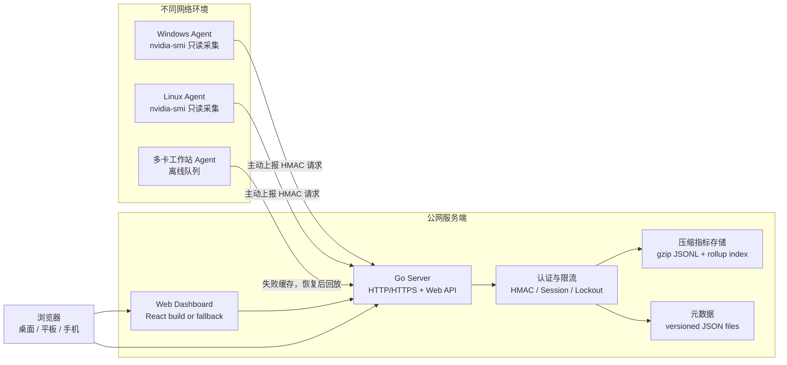
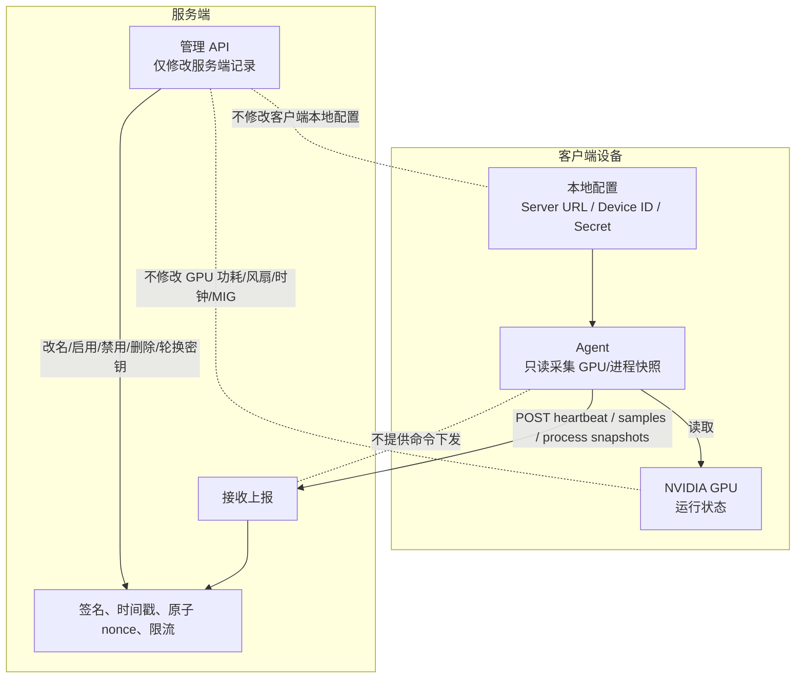
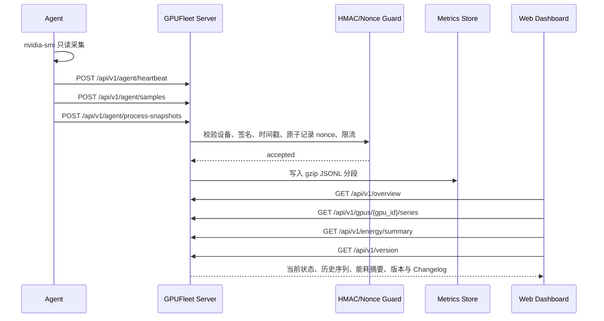
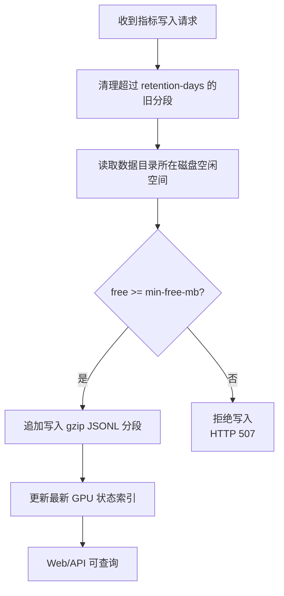
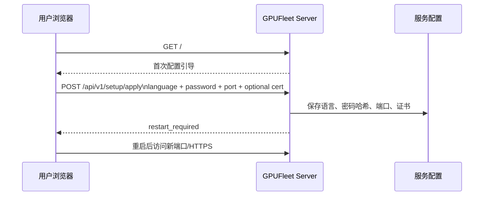
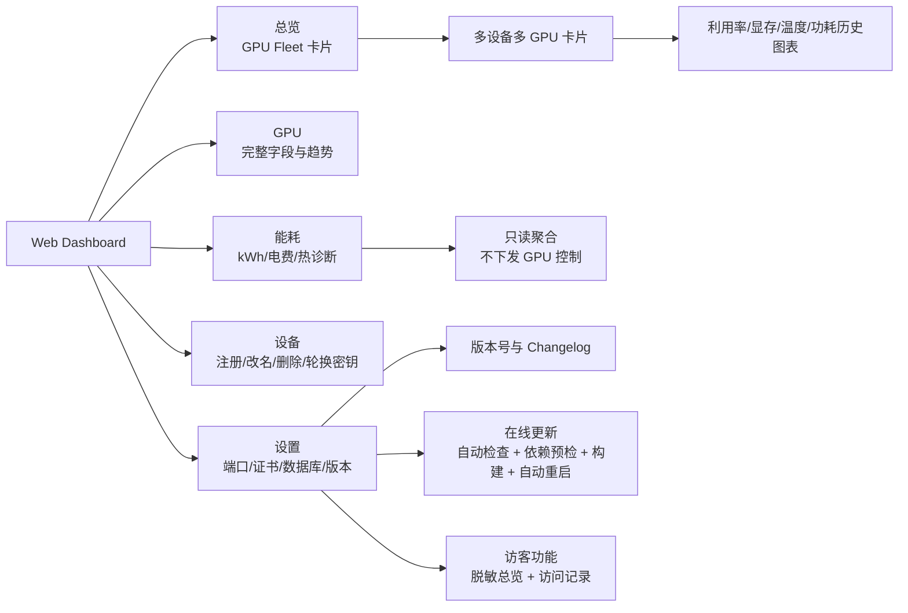
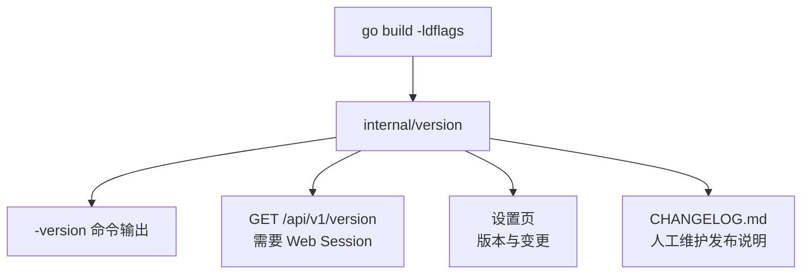
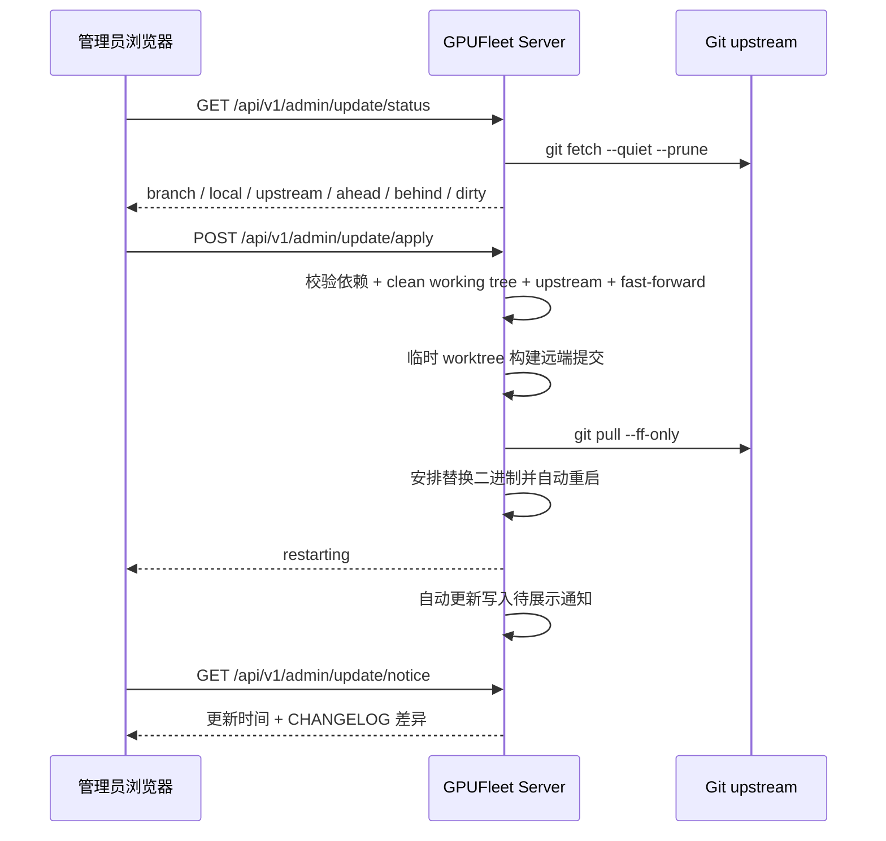

<h1>
  
  GPUFleet
</h1>

[](https://deepwiki.com/stlin256/GPU-Fleet/)
[](https://github.com/stlin256/GPU-Fleet/releases/latest)
[](https://gpufleet-telemetry.stlin256.workers.dev/summary)

GPUFleet 是一个面向多台 NVIDIA GPU 机器的运行观察与运维面板。它把分散在家庭宽带、办公室、云主机或远程机房里的 Windows/Linux 设备接到同一个公网服务端，用一张 Web 面板看清每张卡现在忙不忙、过去一段时间怎么变化、哪些设备掉线、哪些 GPU 温度或 PCIe 状态需要关注，以及当前有哪些进程占用了显存。

它的使用方式很直接：服务端负责登录、设备管理、数据存储、统计、诊断、备份和在线更新；每台设备只运行一个只读 Agent，主动把本机 GPU 指标、可选进程快照和配置快照上报给服务端。服务端不会反连客户端，也不会下发命令、改配置、杀进程或调整 GPU 参数；可选的 Agent 更新也是客户端按策略拉取签名 manifest 和已校验 artifact 后只替换自己的二进制。

English documentation: [README-en.md](README-en.md)<br>
安装指南 / Installation guide: [docs/14-installation.md](docs/14-installation.md)<br>

## GPUFleet 能做什么

- 看总览：把多机多卡聚合成 Fleet 卡片，展示在线状态、利用率、显存、温度、功耗、PCIe、时钟限速和进程摘要；离线设备会有明确蒙版，同一设备下的 GPU 使用同色边框，便于在大盘里快速定位。
- 看历史：每张 GPU 卡片内置利用率、显存、温度、功耗 2x2 趋势图，支持悬浮读数；统计面板支持 1H、6H、24H、7D、30D 等范围，用 rollup 索引支撑长范围查询。
- 看能耗：能耗页把现有功率、温度、利用率和限速原因汇总为 24H/7D/30D 耗电量、电费估算、热状态趋势、GPU 能耗排行、空转高耗和限速/高温诊断；它只做展示和估算，不下发功耗、风扇或频率控制。
- 管设备：在 Web 面板注册设备、复制一次性密钥、改名、禁用/启用、删除和轮换密钥；这些操作只改变服务端认证记录，不会远程修改 Agent 本地配置。
- 管服务：首次启动通过浏览器选择语言、设置密码、端口和可选 HTTPS 证书；设置页可改密码、语言、端口、证书、磁盘预留空间、服务端自动更新、Agent 更新策略、更新代理和旧版 Agent 兼容开关。
- 做运维：服务端可下载数据库和只读诊断包，Linux 部署提供备份/恢复脚本；在线更新会校验官方仓库来源、upstream、工作区状态、fast-forward 路径和目标 commit，构建成功后才拉取并重启。
- 开访客：可以打开 `/guest` 脱敏总览给只读访客查看，访客看不到进程、统计、真实设备 ID、主机名、Agent 信息、驱动版本、GPU UUID、VBIOS 或任何管理接口。
- 保持轻量：默认就是 Go 服务端、Go Agent、React 静态面板、gzip JSONL 分段指标和 JSON 元数据，不要求先搭 Prometheus、Grafana 或外部数据库。
- 看生态：服务端默认启用匿名聚合遥测，只上报部署版本、服务端平台、活跃 Agent 数和活跃 GPU 数，用于 README 顶部的 GPU 数量徽章；不会上传主机名、设备 ID、GPU UUID、进程、用户名、密钥或访问地址。

## 当前状态

GPUFleet 当前版本是 `1.0.13`。核心链路、Web 面板、设备管理、访客模式、长期统计、只读能耗与热状态展示、服务端在线更新、签名校验的 Agent 自更新策略、匿名聚合遥测、诊断包、备份恢复和前端浏览器级 smoke 验证都已经落地。VictoriaMetrics、SQLite、告警规则配置、CSV 导出和 SSE 实时推送仍作为后续增强项保留。

## 产品截图


## 总体架构



## 安全边界

GPUFleet 的安全边界是产品设计的一部分：服务端不能对客户端产生设置影响，也不能远程执行客户端动作。



## 数据流



## 存储与磁盘保护

当前默认部署不依赖外部数据库。服务端使用压缩分段文件保存时序指标，使用 JSON 文件保存元数据。每次写入前会先清理超过保留期的旧分段，再检查磁盘剩余空间；低于阈值时拒绝新指标写入，避免占满磁盘。



默认参数：

| 参数 | 默认值 | 说明 |
| --- | --- | --- |
| `-retention-days` | `30` | 压缩指标分段保留天数 |
| `-min-free-mb` | `800` | 写入前必须保留的最小空闲空间 |
| `-data-dir` | `data` | 服务端运行数据目录 |
| `-web-dir` | `web/dist` | React 构建产物目录 |
| `-repo-dir` | `.` | 服务端自身 Git 仓库目录，用于在线更新检查 |

## 首次配置

首次启动时，服务端使用启动参数里的监听端口和 HTTP 协议。浏览器打开面板后会先选择界面语言，再进入配置引导，设置访问密码、下一次启动端口和可选 HTTPS 证书。



登录后也可以在设置页修改语言，或重新打开配置引导，集中调整密码、端口、语言和证书。语言切换即时生效；端口和 HTTPS 证书变更需要重启当前服务进程后完全生效。

## 快速运行

### 构建

Windows PowerShell：

```powershell
$env:GOCACHE='F:\project\GPUFleet\.gocache'
go build -o bin\gpufleet-server.exe .\cmd\gpufleet-server
go build -o bin\gpufleet-agent.exe .\cmd\gpufleet-agent
```

前端修改后重新构建：

```powershell
cd web
npm install
npm run build
cd ..
```

Linux Agent 交叉编译示例：

```powershell
$env:GOOS='linux'
$env:GOARCH='amd64'
go build -o bin\gpufleet-agent ./cmd/gpufleet-agent
Remove-Item Env:\GOOS
Remove-Item Env:\GOARCH
```

### 启动服务端

```powershell
.\bin\gpufleet-server.exe `
  -addr 0.0.0.0:8088 `
  -data-dir data `
  -min-free-mb 800 `
  -retention-days 30 `
  -web-dir web/dist `
  -repo-dir .
```

浏览器打开：

```text
http://127.0.0.1:8088
```

首次访问会进入配置引导。如果用于自动化测试，也可以传入 `-admin-password` 预置密码：

```powershell
.\bin\gpufleet-server.exe `
  -addr 127.0.0.1:8088 `
  -data-dir data `
  -admin-password change-me `
  -min-free-mb 800 `
  -retention-days 30 `
  -web-dir web/dist `
  -repo-dir .
```

匿名聚合遥测默认开启。服务端每天带随机抖动向 `https://gpufleet-telemetry.stlin256.workers.dev/v1/report` 上报一次，只包含版本、服务端 OS/架构、Agent 总数/活跃数和 GPU 总数/活跃数；上报会复用设置页配置的服务端代理。可用 `-disable-telemetry` 或 `GPUFLEET_DISABLE_TELEMETRY=true` 关闭，也可用 `-telemetry-url` 或 `GPUFLEET_TELEMETRY_URL` 指向自托管统计端点。

### 启动 Agent

先在 Web 面板的“设备”页创建设备并复制一次性密钥，然后在目标机器运行：

```powershell
.\bin\gpufleet-agent.exe `
  -server-url http://your-server:8088 `
  -device-id device_20260603120000 `
  -secret replace-with-one-time-secret `
  -processes
```

一次性上报：

```powershell
.\bin\gpufleet-agent.exe `
  -server-url http://127.0.0.1:8088 `
  -device-id device_20260603120000 `
  -secret replace-with-one-time-secret `
  -once `
  -processes
```

只在本机采集并打印，不上报：

```powershell
.\bin\gpufleet-agent.exe -print
```

## 服务安装

Windows 计划任务（推荐使用发布包，无需在客户端安装 Go）：

```powershell
.\scripts\install-agent-windows.ps1 `
  -ServerUrl "https://your-server:8443" `
  -DeviceId "device_xxx" `
  -Secret "replace-with-device-secret"
```

安装脚本会校验 `gpufleet-agent.exe` 版本，默认执行一次性上报预检，把凭据写入 `C:\ProgramData\GPUFleet\agent.env`，并创建名为 `GPUFleetAgent` 的开机自启计划任务。日志位置：

```powershell
Get-Content "C:\ProgramData\GPUFleet\logs\agent.log" -Tail 100
```

Linux systemd：

```sh
sudo SERVER_URL="https://your-server:8443" \
  DEVICE_ID="device_xxx" \
  SECRET="replace-with-device-secret" \
  sh ./scripts/install-agent-linux.sh
```

卸载脚本：

```powershell
.\scripts\uninstall-agent-windows.ps1
```

```sh
sudo sh ./scripts/uninstall-agent-linux.sh
```

## Web 面板

Web 面板有五个主视图：

- 总览：多机多卡 GPU Fleet 卡片、每卡 4 个历史趋势图、顶部汇总迷你曲线、离线灰色蒙版、同设备 GPU 边框同色、设备和进程摘要。
- GPU：完整 GPU 运行字段、2x2 历史趋势图、可展开的 24 小时 GPU 曲线、进程快照和统计。
- 能耗：展示当前功率、范围耗电、电费估算、热状态趋势、GPU 能耗排行、空转高耗、高温和限速诊断；设置页可调整电价和诊断阈值，这些参数只影响展示估算。
- 设备：创建设备、展示一次性密钥、改名、禁用/启用设备、删除设备、轮换密钥；危险操作使用应用内弹窗二次确认。
- 设置：服务状态、密码更改、端口配置、语言设置、HTTPS 证书上传、证书到期日期、数据库下载、磁盘预留空间、自动/手动在线更新、手动重启服务、访客功能、配置引导、作者/仓库、版本号和 Changelog。
- 访客总览：仅展示脱敏后的总览和 GPU 卡片曲线；移动端不显示底部导航栏，设备区域只显示设备名称和在线状态。



## 版本与 Changelog

版本信息由 `internal/version` 统一管理：

- `Version`：当前版本号。
- `Commit`：构建提交，可通过 `-ldflags` 注入。
- `BuildTime`：构建时间，可通过 `-ldflags` 注入。
- `Changelog()`：内置结构化变更记录，作为 `CHANGELOG.md` 读取失败时的 fallback。
- `CHANGELOG.md`：设置页优先读取的完整发布说明；设置页默认显示当前版本，点击“更多更新记录”后在全屏弹窗中查看完整记录。

查看二进制版本：

```powershell
.\bin\gpufleet-server.exe -version
.\bin\gpufleet-agent.exe -version
```

注入构建信息示例：

```powershell
$commit = git rev-parse HEAD
$buildTime = (Get-Date).ToUniversalTime().ToString("yyyy-MM-ddTHH:mm:ssZ")
go build `
  -ldflags "-X gpufleet/internal/version.Commit=$commit -X gpufleet/internal/version.BuildTime=$buildTime" `
  -o bin\gpufleet-server.exe .\cmd\gpufleet-server
```

Web 设置页通过登录后的接口读取版本信息：

```text
GET /api/v1/version
```



### 发布包

完整发布包由 `scripts/build-release.ps1` 或 GitHub Release 工作流生成。默认 `full` 矩阵会尽量覆盖 Go 可稳定交叉编译的 Windows、Linux、macOS 和 FreeBSD 架构，包括 Linux armv5/armv6/armv7 等 ARM 变体；Windows/Linux 是 NVIDIA GPU Agent 的主要支持系统，macOS/FreeBSD 包主要用于完整性和具备 `nvidia-smi` 环境时的诊断。

```text
gpufleet-server_<version>_windows_amd64.zip
gpufleet-agent_<version>_windows_amd64.zip
gpufleet-server_<version>_windows_arm64.zip
gpufleet-agent_<version>_windows_arm64.zip
gpufleet-server_<version>_linux_amd64.tar.gz
gpufleet-agent_<version>_linux_amd64.tar.gz
gpufleet-server_<version>_linux_arm64.tar.gz
gpufleet-agent_<version>_linux_arm64.tar.gz
gpufleet-server_<version>_darwin_arm64.tar.gz
gpufleet-agent_<version>_darwin_arm64.tar.gz
gpufleet-server_<version>_freebsd_amd64.tar.gz
gpufleet-agent_<version>_freebsd_amd64.tar.gz
gpufleet_<version>_checksums.txt
```

本地构建发布包：

```powershell
.\scripts\build-release.ps1
```

只构建核心矩阵或指定目标：

```powershell
.\scripts\build-release.ps1 -TargetSet core
.\scripts\build-release.ps1 -Targets windows/amd64,linux/amd64,linux/arm64
```

推送标签后 GitHub Actions 会构建并发布 Release：

```sh
git tag v1.0.13
git push origin v1.0.13
```

## 服务端在线更新

服务端在线更新默认开启，每 30 分钟检查当前 Git 上游是否有可 fast-forward 的新提交；存在更新时会自动构建、拉取并调度服务端重启。管理员也可以在设置页手动检查并点击“更新”。该机制只操作服务端自身仓库和当前服务端进程，不会连接或修改任何客户端 Agent。更新状态会缓存 1 小时，打开设置页时优先显示缓存；管理员仍可点击检查更新立即刷新。更新支持配置代理地址，并在手动执行前显示全屏模糊确认弹窗。替换服务端二进制前会保留上一版 `.bak` 文件，重启脚本在替换或启动阶段失败时会尽量恢复旧二进制。

Agent 更新是独立的 pull 模型：设置页默认面向普通用户只保留 Agent 自动更新开关、更新范围摘要和保存按钮；签名 manifest URL 与 Ed25519 公钥可由部署环境通过 `GPUFLEET_AGENT_UPDATE_MANIFEST_URL`、`GPUFLEET_AGENT_UPDATE_PUBLIC_KEY` 或同名启动参数预置，必要时再在高级设置中覆盖目标版本、更新模式、检查间隔和并发上限。目标版本留空时表示按更新模式选择允许的最新补丁。Agent 通过 HMAC 拉取策略，自行下载 manifest 和 artifact，验证签名与 sha256 后只替换自己的二进制，并把检查、失败、应用或回滚事件上报给服务端审计。服务端不会向 Agent 下发 shell 命令。



安全约束：

- 需要已登录的 Web Cookie Session。
- 前端不能传入命令、分支、远端或路径。
- 服务端只在 `-repo-dir` 指定的仓库目录内执行固定 Git 参数，并使用固定的 `go build ./cmd/gpufleet-server` 构建服务端。
- 更新前会检查 `git`、`go`、Windows 的 `powershell.exe` 或 Linux 的 `/bin/sh`、服务端源码入口和当前可执行文件目录写入权限。
- 网络远端必须指向官方 `github.com/stlin256/gpu-fleet` 仓库，并通过 upstream、工作区、fast-forward 和精确目标 commit 校验。
- 工作区存在未提交改动、没有 upstream、本地超前或分叉时拒绝拉取。
- 构建成功后才会 fast-forward 当前工作区；随后重启器替换当前服务端二进制，并按原启动参数拉起新进程。
- 自动更新成功后会保存一条管理员待读通知；同版本更新只展示上次未出现或发生变化的 `CHANGELOG.md` 行，若 changelog 完全相同则显示“无更新说明”。
- 更新、证书启用和手动重启都会使用全屏背景模糊进度弹窗等待服务恢复；重启阶段进度条停在 99%，恢复后刷新页面并展示需要确认的完成提示。

## API 概览

Agent API：

```text
POST /api/v1/agent/heartbeat
POST /api/v1/agent/samples
POST /api/v1/agent/process-snapshots
POST /api/v1/agent/config
POST /api/v1/agent/update-policy
POST /api/v1/agent/update-events
```

Web API：

```text
GET  /api/v1/setup/status
POST /api/v1/setup/apply
POST /api/v1/auth/login
POST /api/v1/auth/logout
GET  /api/v1/version
GET  /api/v1/overview
GET  /api/v1/devices
GET  /api/v1/gpus/{gpu_id}/series
GET  /api/v1/energy/summary
GET  /api/v1/guest/status
GET  /api/v1/guest/overview
GET  /api/v1/guest/gpus/{gpu_id}/series
GET  /api/v1/stats/gpu-utilization
GET  /api/v1/processes/latest
POST /api/v1/admin/setup/reopen
POST /api/v1/admin/setup/apply
POST /api/v1/admin/password
POST /api/v1/admin/certificate
GET  /api/v1/admin/database/download
GET  /api/v1/admin/diagnostics/download
POST /api/v1/admin/language
POST /api/v1/admin/server-config
POST /api/v1/admin/guest
GET  /api/v1/admin/guest/visits
POST /api/v1/admin/restart
GET  /api/v1/admin/update/status
POST /api/v1/admin/update/proxy
POST /api/v1/admin/update/apply
GET  /api/v1/admin/update/notice
POST /api/v1/admin/devices
PATCH /api/v1/admin/devices/{device_id}
DELETE /api/v1/admin/devices/{device_id}
POST /api/v1/admin/devices/{device_id}/enable
POST /api/v1/admin/devices/{device_id}/disable
POST /api/v1/admin/devices/{device_id}/rotate-secret
```

完整契约见 [docs/06-api-contract.md](docs/06-api-contract.md)。

## 测试与验证

Go 测试：

```powershell
$env:GOCACHE='F:\project\GPUFleet\.gocache'
go test ./...
```

前端构建：

```powershell
cd web
npm run build
cd ..
```

初始化 5 块 GPU 演示数据，其中 2 块属于同一设备，且包含 1 台离线设备：

```powershell
node scripts\seed-demo-data.mjs --data-dir logs\manual-demo\data
```

浏览器级验证：

```powershell
node scripts\verify-frontend-chrome.mjs `
  --url http://127.0.0.1:8088 `
  --password demo-admin `
  --out logs\frontend-verify-manual `
  --expected-version v1.0.13 `
  --min-fleet-cards 5 `
  --require-offline-mask true `
  --require-dual-device true
```

验证脚本会检查登录、30 天 Cookie 会话恢复、总览卡片、每卡历史图表、悬浮读数、离线蒙版、同设备边框同色、深浅主题、移动端无横向溢出、设置页操作入口、数据库/诊断包下载入口、在线更新入口、访客记录弹窗、完整 Changelog 弹窗、重启确认弹窗、版本号和截图非空。

## 项目结构

```text
cmd/
  gpufleet-server/      服务端入口
  gpufleet-agent/       Agent 入口
internal/
  agent/                采集、上报、本地队列
  auth/                 HMAC 签名
  disk/                 跨平台磁盘空间检测
  model/                API 数据模型
  server/               HTTP 服务、存储、会话、限流、fallback 面板
  version/              版本号与结构化 Changelog
web/
  src/                  React 面板源码
  public/brand/         SVG 品牌 Logo
  dist/                 已构建静态资源
scripts/                安装、卸载、演示数据、前端验证脚本
docs/                   设计、API、前端、测试和运维文档
```

## 详细文档

- [产品细节](docs/01-product.md)
- [总体架构](docs/02-architecture.md)
- [安全设计](docs/03-security.md)
- [数据存储与磁盘保护](docs/04-data-storage-retention.md)
- [Agent 设计](docs/05-agent.md)
- [API 契约](docs/06-api-contract.md)
- [Web 前端设计](docs/07-frontend.md)
- [测试与本机验证](docs/08-testing.md)
- [实施路线图](docs/09-roadmap.md)
- [参考资料](docs/10-references.md)
- [当前实现说明](docs/11-current-implementation.md)
- [运维与安装](docs/12-operations.md)
- [安装指南 / Installation](docs/14-installation.md)
