# GPUFleet


GPUFleet 是一个依赖尽量简单的 NVIDIA GPU 多设备监控系统。它由公网服务端和多台 Windows/Linux 客户端 Agent 组成，用于聚合不同网络环境中多台机器的 GPU 运行信息，并在一个支持深浅主题和移动端适配的 Web 面板中展示、统计和下载数据。

当前版本：`0.1.1`<br>
作者：`stlin256`<br>
仓库：`https://github.com/stlin256/GPU-Fleet`

## 核心目标

- 客户端只做本机只读采集，主动访问公网服务端，不开放监听端口。
- 服务端只接收、校验、存储、统计和展示数据，不向客户端下发命令或配置。
- 默认使用 Go 单文件服务端、Go 单文件 Agent、gzip JSONL 分段文件和 JSON 元数据，避免引入复杂基础设施。
- 数据库具备压缩、保留期清理和空间保护，默认预留 `800MiB` 空闲磁盘。
- Web 面板优先展示多机多卡 GPU Fleet 卡片，卡片内使用历史图表而非进度条，支持离线蒙版、同设备边框同色和悬浮读数。
- 首次启动通过浏览器配置访问密码、端口和可选 HTTPS 证书；未配置证书时使用 HTTP，配置证书并重启后使用 HTTPS。
- Web 登录仅使用密码，登录后记住当前浏览器设备 30 天。

## 当前能力

| 模块 | 状态 | 说明 |
| --- | --- | --- |
| 服务端 | 已实现 | HTTP/HTTPS、HMAC Agent 接入、Web API、静态面板托管、内置 fallback 面板 |
| Agent | 已实现 | Windows/Linux，基于 `nvidia-smi` 只读采集，支持离线队列 |
| Web 面板 | 已实现 | React + Vite + TypeScript + TanStack Query + ECharts + lucide-react |
| 设备管理 | 已实现 | 创建设备、一次性密钥、改名、禁用/启用、删除、轮换密钥、危险操作确认 |
| 数据存储 | 已实现 | gzip JSONL 分段指标、JSON 元数据、保留期清理、数据库下载 |
| 安全防护 | 已实现 | HMAC 签名、nonce 重放保护、登录限流、递进锁定、30 天会话 |
| 版本机制 | 已实现 | `-version` 命令、`/api/v1/version`、设置页版本与 Changelog、`CHANGELOG.md` |
| 在线更新 | 已实现 | 设置页检查 Git upstream、显示提交差异，并仅执行干净工作区的 fast-forward 拉取 |

## 产品截图

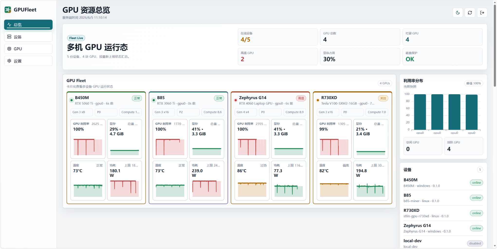

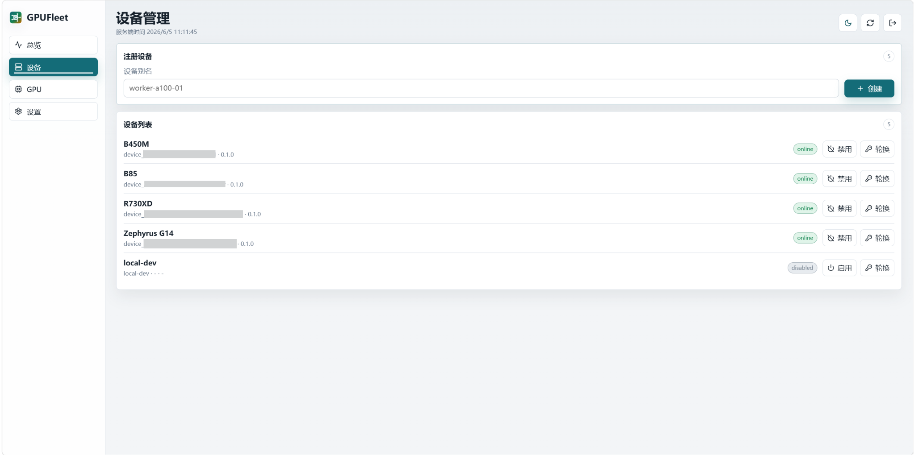

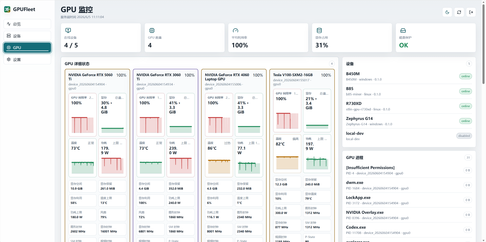

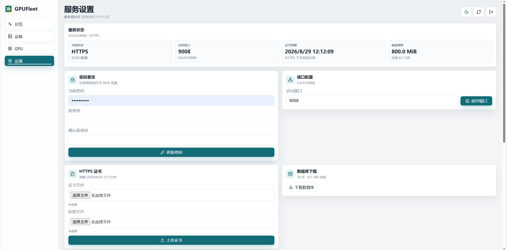

## 总体架构

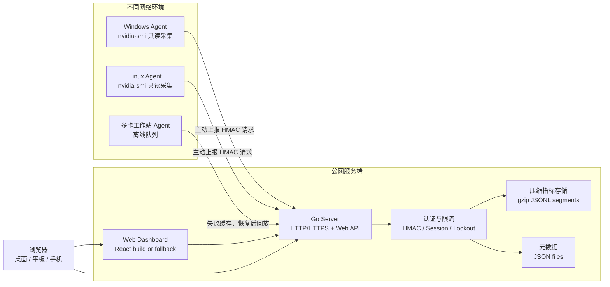

## 安全边界

GPUFleet 的安全边界是产品设计的一部分：服务端不能对客户端产生设置影响，也不能远程执行客户端动作。

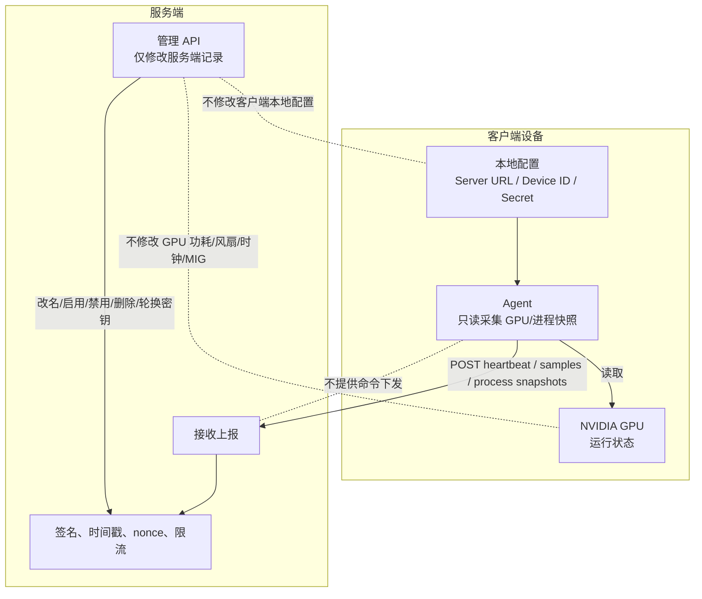

## 数据流

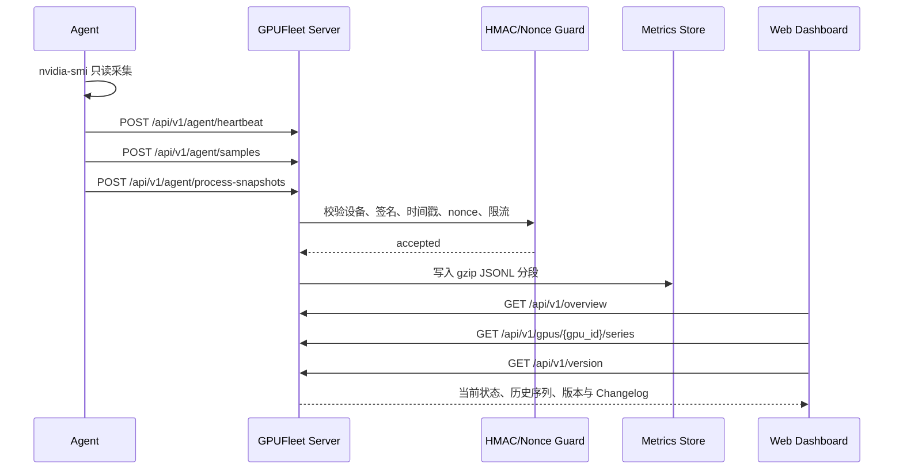

## 存储与磁盘保护

当前 MVP 不依赖外部数据库。服务端使用压缩分段文件保存时序指标，使用 JSON 文件保存元数据。每次写入前会先清理超过保留期的旧分段，再检查磁盘剩余空间；低于阈值时拒绝新指标写入，避免占满磁盘。

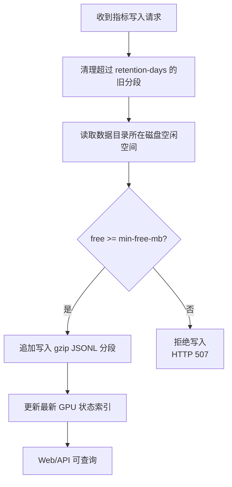

默认参数：

| 参数 | 默认值 | 说明 |
| --- | --- | --- |
| `-retention-days` | `30` | 压缩指标分段保留天数 |
| `-min-free-mb` | `800` | 写入前必须保留的最小空闲空间 |
| `-data-dir` | `data` | 服务端运行数据目录 |
| `-web-dir` | `web/dist` | React 构建产物目录 |
| `-repo-dir` | `.` | 服务端自身 Git 仓库目录，用于在线更新检查 |

## 首次配置

首次启动时，服务端使用启动参数里的监听端口和 HTTP 协议。浏览器打开面板后会进入配置引导，设置访问密码、下一次启动端口和可选 HTTPS 证书。

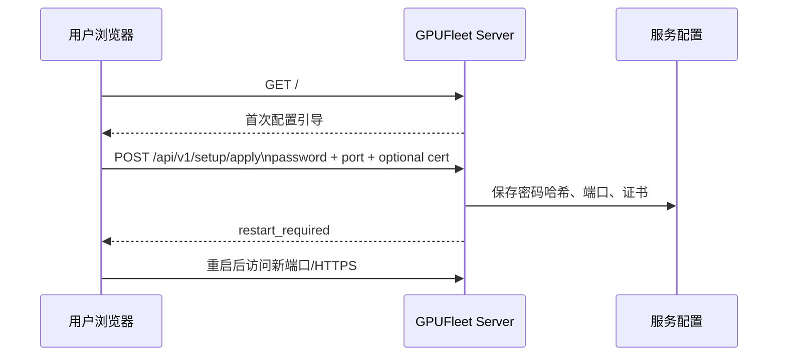

登录后也可以在设置页重新打开配置引导，集中调整密码、端口和证书。端口和 HTTPS 证书变更需要重启当前服务进程后完全生效。

## 快速运行

### 构建

Windows PowerShell：

```powershell
$env:GOCACHE='F:\project\GPUFleet\.gocache'
go build -o bin\gpufleet-server.exe .\cmd\gpufleet-server
go build -o bin\gpufleet-agent.exe .\cmd\gpufleet-agent
```

前端修改后重新构建：

```powershell
cd web
npm install
npm run build
cd ..
```

Linux Agent 交叉编译示例：

```powershell
$env:GOOS='linux'
$env:GOARCH='amd64'
go build -o bin\gpufleet-agent ./cmd/gpufleet-agent
Remove-Item Env:\GOOS
Remove-Item Env:\GOARCH
```

### 启动服务端

```powershell
.\bin\gpufleet-server.exe `
  -addr 0.0.0.0:8088 `
  -data-dir data `
  -min-free-mb 800 `
  -retention-days 30 `
  -web-dir web/dist `
  -repo-dir .
```

浏览器打开：

```text
http://127.0.0.1:8088
```

首次访问会进入配置引导。如果用于自动化测试，也可以传入 `-admin-password` 预置密码：

```powershell
.\bin\gpufleet-server.exe `
  -addr 127.0.0.1:8088 `
  -data-dir data `
  -admin-password change-me `
  -min-free-mb 800 `
  -retention-days 30 `
  -web-dir web/dist `
  -repo-dir .
```

### 启动 Agent

先在 Web 面板的“设备”页创建设备并复制一次性密钥，然后在目标机器运行：

```powershell
.\bin\gpufleet-agent.exe `
  -server-url http://your-server:8088 `
  -device-id device_20260603120000 `
  -secret replace-with-one-time-secret `
  -processes
```

一次性上报：

```powershell
.\bin\gpufleet-agent.exe `
  -server-url http://127.0.0.1:8088 `
  -device-id local-dev `
  -secret local-dev-secret `
  -once `
  -processes
```

只在本机采集并打印，不上报：

```powershell
.\bin\gpufleet-agent.exe -print
```

## 服务安装

Windows Service：

```powershell
.\scripts\install-agent-windows.ps1 `
  -ServerUrl "https://your-server:8443" `
  -DeviceId "device_xxx" `
  -Secret "replace-with-device-secret"
```

Linux systemd：

```sh
sudo SERVER_URL="https://your-server:8443" \
  DEVICE_ID="device_xxx" \
  SECRET="replace-with-device-secret" \
  sh ./scripts/install-agent-linux.sh
```

卸载脚本：

```powershell
.\scripts\uninstall-agent-windows.ps1
```

```sh
sudo sh ./scripts/uninstall-agent-linux.sh
```

## Web 面板

Web 面板有四个主视图：

- 总览：多机多卡 GPU Fleet 卡片、每卡 4 个历史趋势图、离线灰色蒙版、同设备 GPU 边框同色、设备和进程摘要。
- 设备：创建设备、展示一次性密钥、改名、禁用/启用设备、删除设备、轮换密钥；危险操作使用应用内弹窗二次确认。
- GPU：完整 GPU 运行字段、2x2 历史趋势图、进程快照和统计。
- 设置：服务状态、密码更改、端口配置、HTTPS 证书上传、证书到期日期、数据库下载、在线更新、配置引导、作者/仓库、版本号和 Changelog。

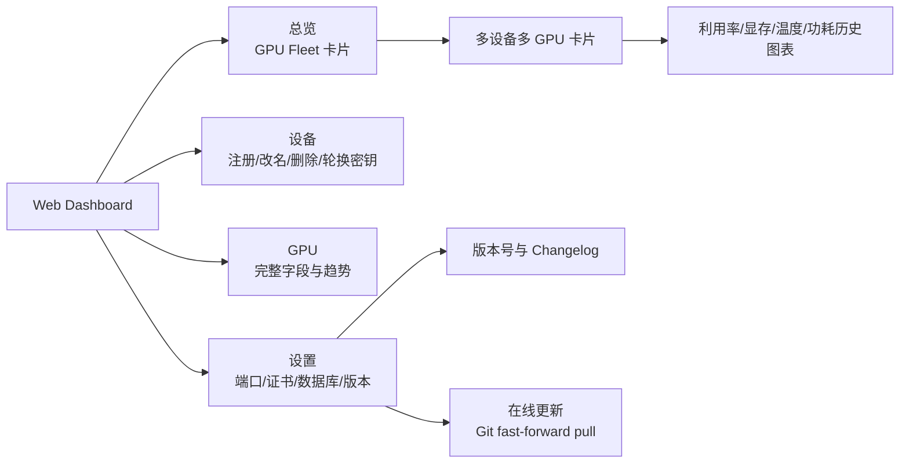

## 版本与 Changelog

版本信息由 `internal/version` 统一管理：

- `Version`：当前版本号。
- `Commit`：构建提交，可通过 `-ldflags` 注入。
- `BuildTime`：构建时间，可通过 `-ldflags` 注入。
- `Changelog()`：结构化变更记录，用于 API 和设置页。

查看二进制版本：

```powershell
.\bin\gpufleet-server.exe -version
.\bin\gpufleet-agent.exe -version
```

注入构建信息示例：

```powershell
$commit = git rev-parse --short HEAD
$buildTime = (Get-Date).ToUniversalTime().ToString("yyyy-MM-ddTHH:mm:ssZ")
go build `
  -ldflags "-X gpufleet/internal/version.Commit=$commit -X gpufleet/internal/version.BuildTime=$buildTime" `
  -o bin\gpufleet-server.exe .\cmd\gpufleet-server
```

Web 设置页通过登录后的接口读取版本信息：

```text
GET /api/v1/version
```

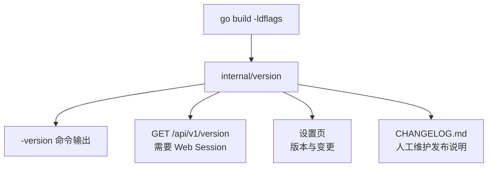

## 服务端在线更新

服务端可以在设置页检查当前 Git 上游是否有新版本，并由管理员点击“拉取更新”。该机制只操作服务端自身仓库，不会连接或修改任何客户端 Agent。

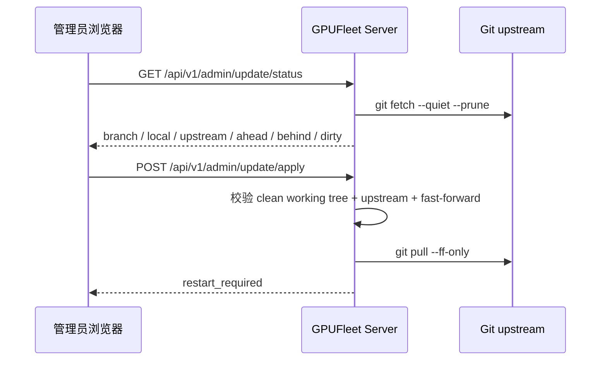

安全约束：

- 需要已登录的 Web Cookie Session。
- 前端不能传入命令、分支、远端或路径。
- 服务端只在 `-repo-dir` 指定的仓库目录内执行固定 Git 参数。
- 工作区存在未提交改动、没有 upstream、本地超前或分叉时拒绝拉取。
- 拉取后不会自动重启进程；按当前部署方式重启或重建服务端后生效。

## API 概览

Agent API：

```text
POST /api/v1/agent/heartbeat
POST /api/v1/agent/samples
POST /api/v1/agent/process-snapshots
```

Web API：

```text
GET  /api/v1/setup/status
POST /api/v1/setup/apply
POST /api/v1/auth/login
POST /api/v1/auth/logout
GET  /api/v1/version
GET  /api/v1/overview
GET  /api/v1/gpus/{gpu_id}/series
GET  /api/v1/stats/gpu-utilization
GET  /api/v1/processes/latest
GET  /api/v1/admin/database/download
GET  /api/v1/admin/update/status
POST /api/v1/admin/update/apply
POST /api/v1/admin/devices
PATCH /api/v1/admin/devices/{device_id}
DELETE /api/v1/admin/devices/{device_id}
POST /api/v1/admin/devices/{device_id}/enable
POST /api/v1/admin/devices/{device_id}/disable
POST /api/v1/admin/devices/{device_id}/rotate-secret
```

完整契约见 [docs/06-api-contract.md](docs/06-api-contract.md)。

## 测试与验证

Go 测试：

```powershell
$env:GOCACHE='F:\project\GPUFleet\.gocache'
go test ./...
```

前端构建：

```powershell
cd web
npm run build
cd ..
```

初始化 5 块 GPU 演示数据，其中 2 块属于同一设备，且包含 1 台离线设备：

```powershell
node scripts\seed-demo-data.mjs --data-dir logs\manual-demo\data
```

浏览器级验证：

```powershell
node scripts\verify-frontend-chrome.mjs `
  --url http://127.0.0.1:8088 `
  --password demo-admin `
  --out logs\frontend-verify-manual `
  --min-fleet-cards 5 `
  --require-offline-mask true `
  --require-dual-device true
```

验证脚本会检查登录、30 天 Cookie 会话恢复、总览卡片、每卡历史图表、悬浮读数、离线蒙版、同设备边框同色、深浅主题、移动端无横向溢出、设置页操作入口、在线更新入口、版本号和 Changelog。

## 项目结构

```text
cmd/
  gpufleet-server/      服务端入口
  gpufleet-agent/       Agent 入口
internal/
  agent/                采集、上报、本地队列
  auth/                 HMAC 签名
  disk/                 跨平台磁盘空间检测
  model/                API 数据模型
  server/               HTTP 服务、存储、会话、限流、fallback 面板
  version/              版本号与结构化 Changelog
web/
  src/                  React 面板源码
  public/brand/         SVG 品牌 Logo
  dist/                 已构建静态资源
scripts/                安装、卸载、演示数据、前端验证脚本
docs/                   设计、API、前端、测试和运维文档
```

## 详细文档

- [产品细节](docs/01-product.md)
- [总体架构](docs/02-architecture.md)
- [安全设计](docs/03-security.md)
- [数据存储与磁盘保护](docs/04-data-storage-retention.md)
- [Agent 设计](docs/05-agent.md)
- [API 契约](docs/06-api-contract.md)
- [Web 前端设计](docs/07-frontend.md)
- [测试与本机验证](docs/08-testing.md)
- [实施路线图](docs/09-roadmap.md)
- [参考资料](docs/10-references.md)
- [当前实现说明](docs/11-current-implementation.md)
- [运维与安装](docs/12-operations.md)
