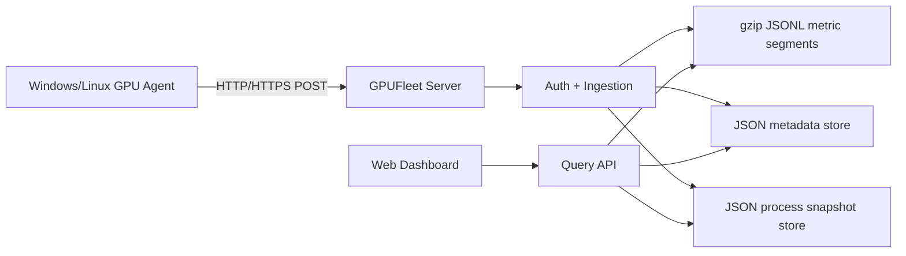

# 总体架构

## 架构原则

- 客户端主动上报，服务端被动接收。
- 数据链路单向，控制链路不存在。
- 服务端组件尽量少，便于单机部署。
- 时序指标和业务元数据分开存储。
- Web 面板通过服务端 API 访问数据，不直接访问数据库。

## 逻辑架构



## 部署架构

MVP 推荐单机部署：

```text
public-server
  gpufleet-server.exe / gpufleet-server
  web/dist/
  data/
    metadata.json
    processes.json
    metrics/
      samples-YYYYMMDDHH.jsonl.gz
```

可选反向代理：

```text
Internet
  -> Caddy/Nginx :80/:443/:custom-port
  -> gpufleet-server :8080
```

若后续引入 VictoriaMetrics 或 SQLite，它们不应直接暴露公网访问。所有写入和查询都通过 GPUFleet Server 做认证、限流和字段约束。

## 端口策略

端口不强制使用 `443`。

建议：

- 开发环境：`http://127.0.0.1:8080`
- 简单公网部署：`https://example.com:8443`
- 标准公网部署：反向代理监听 `443`，内部转发 `8080`
- 特殊网络：使用任意可连通 TCP 端口

Agent 配置中只需要设置：

```toml
server_url = "https://example.com:8443"
device_id = "device_xxx"
secret = "..."
```

## 服务端模块

### Ingestion

- 校验 HMAC。
- 校验时间戳和 nonce。
- 校验 payload 大小。
- 标准化指标单位。
- 写入 gzip JSONL 压缩分段。
- 更新 JSON 元数据中的设备最后在线时间。
- 写入最新 GPU 进程快照。

### Query API

- 读取设备、管理员、审计等元数据。
- 扫描 gzip JSONL 分段生成历史曲线和统计。
- 读取最新 GPU 进程快照。
- 返回前端所需的聚合结果。

### Disk Guard

- 写入指标前清理过期压缩分段。
- 检查数据目录所在磁盘空闲空间。
- 低于 800MiB 时停止接收新指标。
- 写入受限时仍允许登录和查询。
- 记录磁盘保护事件。

### Auth

- Web 用户登录。
- Agent 设备身份认证。
- API Token 管理。
- 审计日志。

## Agent 模块

### Collector

- 当前使用 `nvidia-smi --query-gpu` 和 `nvidia-smi --query-compute-apps`。
- 后续可增强为 NVML。
- Windows/Linux 都支持。

### Sampler

- 默认每 10 秒采集一次 GPU 指标。
- 默认每 30 秒采集一次 GPU 进程信息。
- 采集失败时记录本地错误并继续运行。

### Uploader

- 使用 HTTP/HTTPS 主动上报。
- 支持 gzip 请求压缩。
- 支持批量上报。
- 网络失败时写入本地队列。

### Local Queue

- 默认最大 128MiB。
- 超限后丢弃最旧样本。
- 保证客户端不会因服务端不可用而占满本机磁盘。
